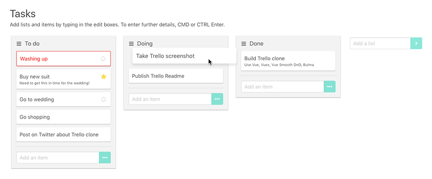

<p align="center"><br><br></p>

Diary of a Rapid Application Build is the journey of an experienced, so-called "senior" developer, building out a full-featured [Trello](http://trello.com) clone – but replacing a more planned, architectural approach with rapid application development techniques.

The aim of the project is to document the shift of mindset required to build applications at speed; what techniques worked, when they worked, what accepted practices got in the way, which assumptions were wrong, and ultimately what got the job done:

[](http://trello.davestewart.io)


## Project structure

The project consists of two parts:

1. source code
2. development diary

Both are part of the repo, and can be checked out in phases via [tags](https://github.com/davestewart/app-diary/tags).

The **source code** is available here:

- https://github.com/davestewart/app-diary

The **application** is online here:

- https://trello.davestewart.io

The **diary** can be read here:

- https://davestewart.github.io/app-diary


## Quick start

Clone the project, then install and run:

```bash
npm install
npm run dev
```

Open the browser to http://localhost:8080 to view the landing page.

